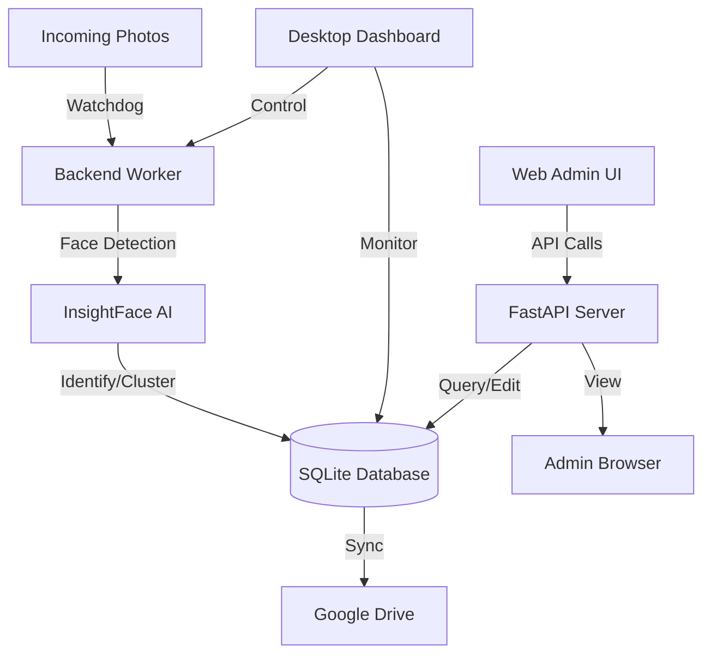

# System Architecture: Wedding Face Forward

This document describes the high-level architecture and data flow of the Wedding Face Forward system.

## 🏗️ Overall Architecture

The system is split into three main layers that work together to process and manage photos:

1. **Backend (Python/InsightFace)**: The engine that monitors for new photos, performs AI face detection and identification, and manages the database.
2. **Frontend (FastAPI/JS)**: A web interface for human administrators to review identifications, manage the database, and download results.
3. **Visual Admin Dashboard (CustomTkinter)**: A desktop "control room" for starting/stopping the system and monitoring real-time performance.

## 🔄 Data Flow (Photo Processing Pipeline)

1. **Ingestion**: A user drops a photo into `EventRoot/Incoming/`.
2. **Detection**: The `watcher.py` triggers the `processor.py`. The system uses **InsightFace** to extract facial embeddings (unique numbers representing a face).
3. **Identification**: The embeddings are compared against the **SQLite Database**.
    - If a match is found: The photo is linked to an existing person.
    - If no match is found: The system checks if it can "cluster" this new face with other unknown faces to form a new person.
4. **Sorting**: Photos are moved/hardlinked to `EventRoot/People/[Person_Name]/`.
5. **Cloud Sync**: If configured, the photos are uploaded to **Google Drive** using the Google Drive API, organized by person folders.
6. **Notification**: The **WhatsApp Tool** can be triggered to notify users when their photos are ready.

## 🛠️ Core Technologies

- **AI Engine**: `insightface`, `onnxruntime` (for high-performance face analysis).
- **Backend Infrastructure**: `watchdog` (file system monitoring), `threading/multiprocessing` (parallel processing).
- **Database**: `sqlite3` (lightweight, portable storage).
- **Web Interface**: `FastAPI` (backend API), `Vite/Vanilla JS` (frontend).
- **Desktop UI**: `CustomTkinter` (modern desktop interface).
- **Cloud Interface**: `google-api-python-client`.

## 📁 Role of Key Modules

- **`db.py`**: Handles all SQL queries. It's the "source of truth" for who is in which photo.
- **`cloud.py`**: Manages the complex logic of creating folders and uploading files to Google Drive without hitting API rate limits.
- **`config.py`**: Centralized configuration that reads from `.env`.
- **`WeddingFFapp.py`**: Integrates all logs and statuses into a single visual window.
